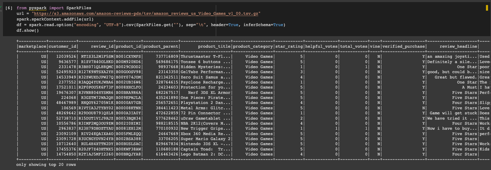
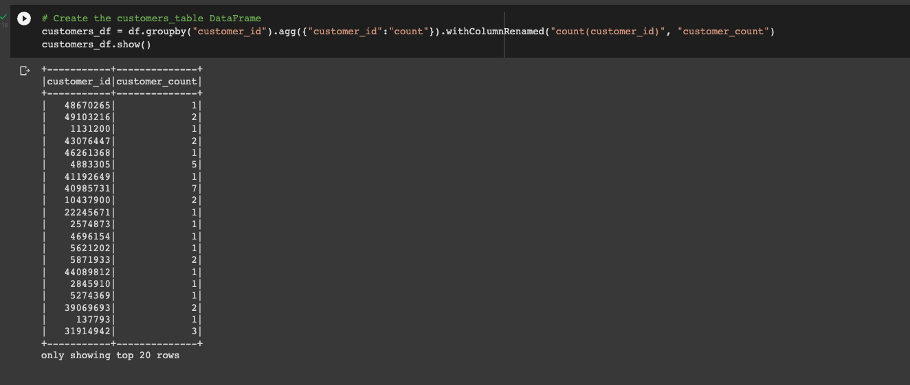
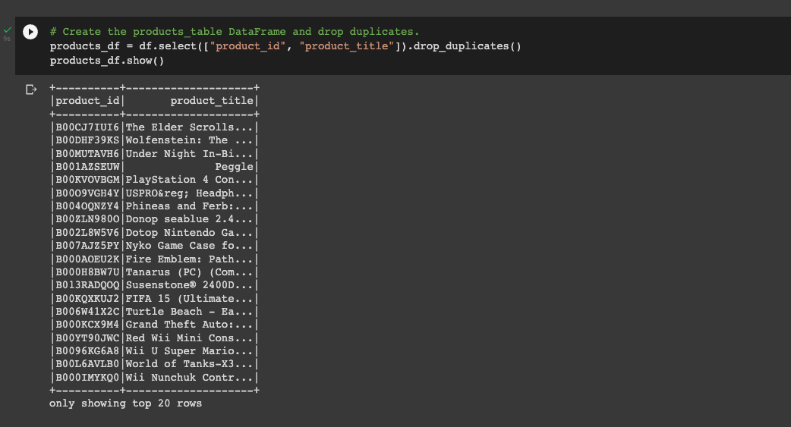
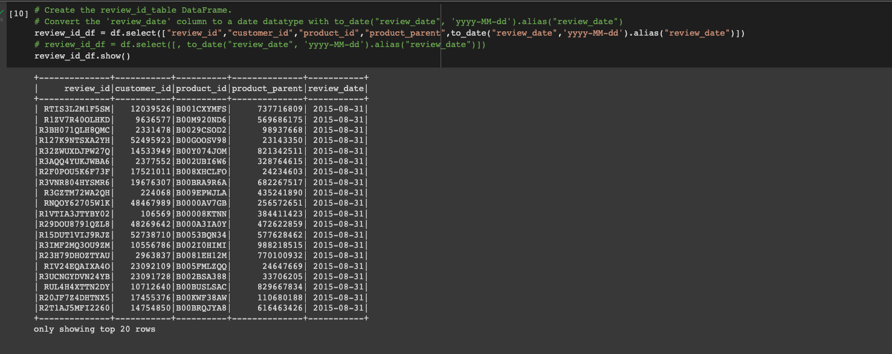
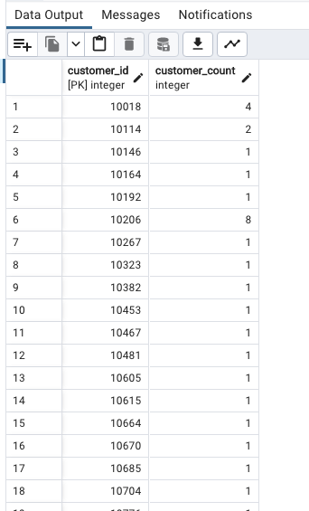
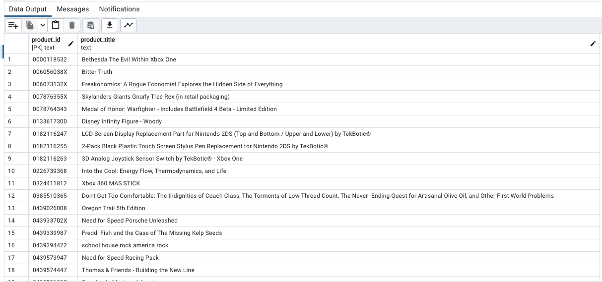
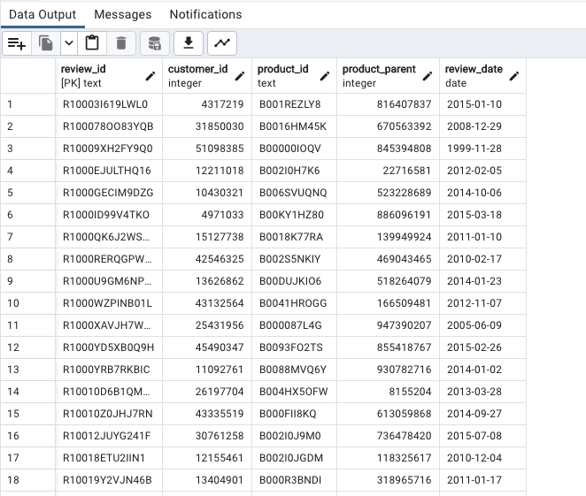
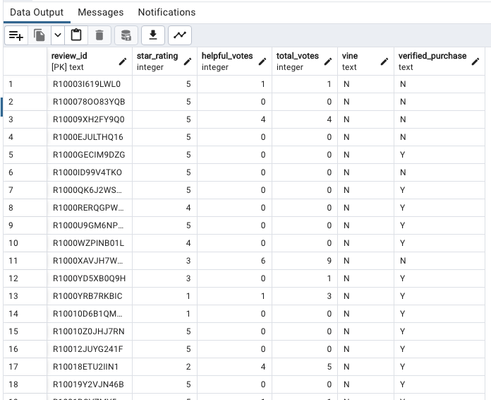

# Amazon_Vine_Analysis
Overview of the analysis:

The objective of this assignment is to pick a dataset from the list of AWS datasets given to us. I picked the Video Games dataset for my analysis.

VideoGames Dataframe:

### Deliverable 1:

- Created an RDS database called "DataViz"
- Defined inbound and outbount security rules in the RDS cosole to be able to connect to the database from PGAdmin 4
- Used PySpark functions to get dataframe information and perform ETL process on the data.

Created the following data frames:

Customers Dataframe:

Products Dataframe:

Review ID Dataframe:

Defined connection String from colab worksheet and inserted data from the dataframes to RDS database and verified data from PGAdmin 4:

Customers Table:

Products Table:

ReviewIdTable:

VineTable:

Overall, this assignment provided me a good exposure to BigData and ETL processes in general.

